<p align="center">
  
</p>

<p align="center">
  <a href="https://github.com/ShakedFlorentin/Prytan/releases"></a>
  <a href="https://github.com/ShakedFlorentin/Prytan"></a>
  <a href=".claude/agents/"></a>
  <a href="scripts/"></a>
  <a href=".claude/hooks/"></a>
  <a href="https://github.com/ShakedFlorentin/Prytan/blob/main/LICENSE"></a>
</p>

<p align="center">
  
  
  
  
  
  <a href="https://github.com/ShakedFlorentin/Prytan/stargazers"></a>
</p>

<h2 align="center">A plug-and-play multi-agent operating system for software teams.</h2>

<p align="center"><em>Clone. Run <code>/init</code>. Ship faster.</em></p>

<p align="center">
<strong>Most teams bolt AI onto one developer's laptop.</strong>
</p>

<p align="center">
Prytan gives your whole team a shared AI council: 16 role-specific agents that route tasks to each other, remember your codebase via a local knowledge graph, surface irreversible decisions to a human, and run autonomously on a cron schedule — all with a hard monthly token budget so you never see a surprise bill. Runs fully local. Zero telemetry. Zero runtime dependencies.
</p>

<p align="center">
Works on <strong>Claude Code</strong> today. One <code>/init</code> wizard adapts it to any project in under 5 minutes.
</p>

<p align="center">
  
</p>

---

## Quickstart

```bash
# Option A — one-liner
curl -fsSL https://raw.githubusercontent.com/ShakedFlorentin/Prytan/main/install.sh | bash

# Option B — manual
git clone https://github.com/ShakedFlorentin/Prytan.git && cd Prytan
./install.sh
```

The installer checks prerequisites, runs the setup wizard, and builds the initial knowledge graph. Then:

```bash
# Open Claude Code and run the agent wizard
claude
/init

# Install the crontab (daily standups, weekly planning, monthly reviews)
crontab scripts/org.crontab

# Optional: start the Telegram bot
python3 scripts/telegram-bot.py
```

> **Prerequisites:** [Claude Code](https://claude.ai/code) (`npm install -g @anthropic/claude-code`) and Python 3.10+.  
> Don't want the wizard? See [setup/SETUP.md](setup/SETUP.md) for manual setup.

---

## How it works

### Architecture

```
You (Telegram / Claude Code)
         │
         ▼
  chief-of-staff (Iris, L3)
  ├─ routes via .agent-handoffs/
  ├─ reads .agent-inbox/ for pending decisions
  └─ pings you on Telegram for one-way doors
         │
         ├──→ coordinator (Nestor, L2)      ← org governance, promotions
         ├──→ tech-lead (Daedalus, L2)    ← architecture, ADRs
         ├──→ org-governor (Kronos, L2)   ← trust management, recurring meetings
         ├──→ backend-engineer (Leon)     ← API, DB, auth
         ├──→ frontend-engineer (Clio)    ← UI, components
         ├──→ qa-engineer (Argus)         ← tests, coverage
         ├──→ devops-engineer (Atlas)     ← Docker, CI/CD
         ├──→ product-manager (Thea)      ← roadmap, specs
         ├──→ ux-designer (Muse)          ← UX flows, design system
         ├──→ security-advisor (Themis)   ← threat model (read-only)
         ├──→ legal-advisor (Solon)       ← licensing, compliance (read-only)
         ├──→ marketing-writer (Lyra)     ← content, SEO, copy
         ├──→ growth-strategist (Kairos)  ← GTM, positioning, funnel
         ├──→ learning-loop (Sophia)      ← nightly lesson distillation
         ├──→ org-doctor (Chiron)         ← nightly agent health audit
         └──→ (your custom agents here)

crontab ──→ cost_governor.py ──→ PROCEED ──→ orchestrator.py ──→ agents
```

### The Agent Council

Every agent is a markdown file in `.claude/agents/`. Each has a role, a trust level, a Greek persona, and a shared behavioral contract.

| Agent | Persona | Domain | Trust |
|---|---|---|---|
| `chief-of-staff` | **Iris** | Human interface, Telegram, routing | L3 |
| `coordinator` | **Nestor** | Org governance, decisions, promotions | L2 |
| `tech-lead` | **Daedalus** | Architecture decisions, ADRs, technical arbitration | L2 |
| `org-governor` | **Kronos** | Trust management, agent proposals, recurring meetings | L2 |
| `backend-engineer` | **Leon** | API, database, auth | L1 |
| `frontend-engineer` | **Clio** | UI, components, React | L1 |
| `qa-engineer` | **Argus** | Tests, coverage, bug repro | L1 |
| `devops-engineer` | **Atlas** | Docker, CI/CD, deploy | L1 |
| `product-manager` | **Thea** | Roadmap, specs, priorities | L1 |
| `ux-designer` | **Muse** | UX flows, design system, Playwright iteration | L1 |
| `security-advisor` | **Themis** | Threat model, review (read-only) | L1 |
| `legal-advisor` | **Solon** | OSS licensing, GDPR, contract review (read-only) | L1 |
| `marketing-writer` | **Lyra** | Content, SEO, copy, press | L1 |
| `growth-strategist` | **Kairos** | GTM, positioning, launch planning, funnel metrics | L1 |
| `learning-loop` | **Sophia** | Nightly lesson distillation into skills store | L1 |
| `org-doctor` | **Chiron** | Nightly agent definition health audit and fixes | L1 |

### Decision routing

Every agent decision is classified before execution:

| Type | Who decides | When |
|---|---|---|
| `two_way` | Agent, autonomously | Reversible actions (refactor, add test, rename) |
| `one_way` | You approve | Irreversible (ship, spend, delete, deploy) |
| `strategic_fork` | You approve | Changes direction or scope |

You only see what matters. Everything else runs without interrupting you.

### Token economy

Four layers of cost control keep your monthly bill predictable:

1. **Codegrapher** — agents query a local offline graph instead of globbing files; a PreToolUse hook enforces query-before-grep
2. **Episodic memo hook** — only the top-N relevant memories are injected per session
3. **Scoped tools** — each agent gets only the tools it needs (`--allowedTools`)
4. **Budget governor** — monthly cap with soft throttle at 80%, hard stop at 100%, and a per-run runaway cap

<p align="center">
  
</p>

---

## Directory layout

```
Prytan/
├── README.md
├── CLAUDE.md                          ← Read by Claude Code on every session
├── LICENSE                            ← MIT
├── SECURITY.md                        ← Vulnerability reporting policy
├── PRIVACY.md                         ← Zero-telemetry guarantee
├── install.sh                         ← One-liner installer
├── codegrapher.py                     ← CLI: query / explain / path / scan
├── codegrapher_hook.py                ← PreToolUse hook: query before grep
├── codegrapher/                       ← Knowledge graph engine (local, no API)
│
├── assets/
│   ├── logo.svg
│   ├── architecture.svg
│   └── features.svg
│
├── .claude/
│   ├── settings.json                  ← Hook wiring (2 lifecycle hooks)
│   ├── hooks/
│   │   └── codegrapher-memo.py        ← Episodic memory hook (fires every prompt)
│   ├── agents/                        ← 16 agent definitions (one .md each)
│   ├── skills/                        ← Bundled skills (docx, xlsx, pdf, …)
│   └── commands/
│       ├── init.md                    ← /init wizard
│       ├── board.md                   ← /board — leadership circle table
│       ├── code-review.md
│       ├── debug.md
│       └── daily-brief.md
│
├── .agent-config/
│   ├── budget.yaml                    ← Monthly token cap + throttle thresholds
│   └── daily-steps.yaml              ← What cron runs and when
│
├── .agent-templates/
│   ├── org-citizenship.md             ← Shared behavioral contract for all agents
│   ├── door-types.md                  ← Decision classification guide
│   └── meetings/                      ← Meeting agenda templates
│
├── scripts/
│   ├── telegram-bot.py                ← Chief-of-staff Telegram interface
│   ├── cost_governor.py               ← PROCEED / THROTTLE / HALT gate
│   ├── orchestrator.py                ← Serial daily step runner
│   ├── dispatch_day.py                ← Autonomous day-runner
│   ├── morning_brief.py               ← Daily digest → Telegram
│   ├── decision_ledger.py             ← Append-only decision log
│   ├── skill_compiler.py              ← Nightly reflection → skills.json
│   ├── skills_store.py                ← Versioned skill lesson store
│   ├── open_tasks.py                  ← Durable task ledger (@@TASK/@@DONE)
│   ├── goal_loop.py                   ← /goal + /loop autonomous work driver
│   ├── write_proposals.py             ← Human-gated file-scoped write grants
│   ├── bot_abilities.py               ← @@GIT / @@SHOW / @@WEB / @@REMIND
│   ├── escalation_guard.py            ← Blocks permission-escalation confabulation
│   ├── claim_guard.py                 ← Flags impossible agent claims
│   ├── agent_violations.py            ← Python-layer violation log
│   ├── agent_doctor.py                ← Nightly agent health checker
│   ├── handoff_reconcile.py           ← Auto-close stale handoffs
│   ├── org.crontab                    ← Install: crontab scripts/org.crontab
│   └── archive-pods.sh                ← Monthly log archiver
│
└── setup/
    ├── SETUP.md                       ← Full manual setup guide
    └── configure.py                   ← /init wizard implementation
```

---

## Commands

### Slash commands (Claude Code)

| Command | What it does |
|---|---|
| `/init` | Setup wizard — configure Prytan for your project in ~10 questions |
| `/board` | Convene the leadership circle table |
| `/code-review` | Structured code review with agent-assigned findings |
| `/debug` | 5-step debugging session with root-cause classification |
| `/daily-brief` | Pull today's org digest |

### Telegram commands

| Command | What it does |
|---|---|
| `/status` | Session + budget status |
| `/standup` | Today's org standup |
| `/brief` | Morning brief |
| `/reset` | Clear the current session |
| `/goal <text>` | Set a persistent goal |
| `/loop` | Start autonomous work toward the current goal |

---

## Lifecycle hooks

Prytan ships two hooks wired in `.claude/settings.json` that fire automatically — no configuration needed.

| Hook | Trigger | File | What it does |
|---|---|---|---|
| **PreToolUse** | Before every `Read`, `Glob`, `Grep`, or `LS` call | `codegrapher_hook.py` | Enforces graph-first: intercepts the file call, queries the knowledge graph, and injects the result so agents don't waste tokens globbing |
| **UserPromptSubmit** | On every user message | `.claude/hooks/codegrapher-memo.py` | Retrieves the top-N most relevant past decisions and injects them as context — episodic memory that survives session resets |

Both hooks are local Python scripts. They write nothing to disk beyond what's already in `.agent-logs/` and make no network calls.

---

## Configuration

### Budget

Edit `.agent-config/budget.yaml`:

```yaml
monthly_token_cap: 50000000   # 50M tokens (~$15/month at Sonnet pricing)
soft_throttle_pct: 80         # trim non-essential work at 80%
circuit_breaker_pct: 100      # hard stop at 100%
runaway_per_run_cap: 4000000  # abort any single run over 4M tokens
```

### Adding reference docs for agents

Drop a markdown file in `.claude/books/` with frontmatter:

```markdown
---
title: "Authentication Design"
tags: [auth, security, jwt]
explains: [login_view, AuthService, verify_token]
---

Your doc content here...
```

Rescan: `python3 codegrapher.py scan src`

Agents find it with: `python3 codegrapher.py query "authentication"`

### Adding a new agent

1. Copy `.claude/agents/backend-engineer.md` → `.claude/agents/my-agent.md`
2. Edit the frontmatter (`name`, `domain`, `model`, `trust_level`, `persona`)
3. Write the role + responsibilities
4. Add it to the routing table in `CLAUDE.md`

---

## Agent markers

The chief-of-staff emits structured markers that the bot layer processes. These never surface to the human.

| Marker | Meaning |
|---|---|
| `@@RUN: <agent> :: <task>` | Dispatch read-only agent |
| `@@RUNW: <agent> :: <task>` | Dispatch write agent (org dirs only) |
| `@@TASK: <title>` / `@@DONE: <ref>` | Open / close durable task |
| `@@GOAL: <text>` / `@@LOOP` | Set goal, start autonomous work |
| `@@WPROPOSE: <agent> :: <files> :: <task>` | Propose human-gated source edit |
| `@@RESOLVE: <id> :: <answer>` | Resolve a pending decision |
| `@@DECIDE: <door_type> :: <title>` | Escalate a decision |
| `@@GIT: <args>` | Read-only git command |
| `@@SHOW: <path>` | Show a file (validated path) |
| `@@WEB: <url>` | Fetch an allowlisted doc URL |
| `@@REMIND: <time> :: <note>` | Schedule self-follow-up |

---

## Safety layer

| Component | What it does |
|---|---|
| `escalation_guard.py` | Blocks confabulated permission-escalation replies |
| `claim_guard.py` | Flags impossible agent claims (no shell access) |
| `agent_violations.py` | Append-only JSONL violation log — never raises, always records |
| `write_proposals.py` | File-scoped write grants require human approval before any source edit |

---

## For Claude (reading this repo)

> This section is for the AI assistant. Humans can skip it.

**What Prytan is:** Generic scaffolding. After `/init`, `CLAUDE.md` and agent files are updated with project-specific routing. Before `/init`, treat everything as a template.

**On first use (before `/init`):**
- Read `setup/SETUP.md` and `.claude/commands/init.md`
- Ask the user the 10 setup questions
- Write config files and update `CLAUDE.md`
- Run `python3 codegrapher.py scan src` to build the initial graph

**On every session:**
- Query the graph before reading files: `python3 codegrapher.py query "<topic>"`
- Check `.agent-inbox/` for pending handoffs or decisions
- Read `.agent-templates/org-citizenship.md` — it's your behavioral contract
- Default trust level is L1 — escalate `one_way` / `strategic_fork` decisions to the coordinator

**Key paths:**

| Path | Purpose |
|---|---|
| `.claude/agents/*.md` | Agent definitions |
| `.agent-templates/org-citizenship.md` | Behavioral contract |
| `.agent-templates/door-types.md` | Decision classification guide |
| `.agent-config/budget.yaml` | Token budget |
| `.agent-config/daily-steps.yaml` | Cron step definitions |
| `.agent-inbox/` | Pending handoffs and decisions |
| `.agent-logs/` | Decision ledger, skill store, violation log |

**Graph-first rule:** Never grep or glob without first running `python3 codegrapher.py query "<topic>"`. The hook will remind you, but the reason is real — the graph finds the right file in one call; blind grep can cost 10× the tokens.

---

## License

MIT — use it freely, ship fast, and send a PR if you make it better.

---

<p align="center">
  Built with ☕ and Greek mythology.<br>
  <a href="https://github.com/ShakedFlorentin/Prytan/issues">Open an issue</a> · <a href="https://github.com/ShakedFlorentin/Prytan/pulls">Send a PR</a>
</p>
